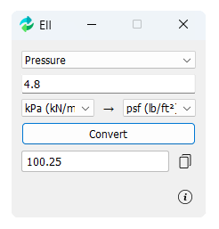

# Ell – Engineering Unit Converter

A lightweight, always-on-top **unit converter** desktop application for civil and structural engineers, built with **C++ and Qt 5**. Supports multiple categories of units and provides **From → To conversion** with a clean GUI.

## Features

- Supports **8 major categories**:
  - **Length**: mm, cm, m, km, in, ft, mile, yard  
  - **Temperature**: °C, °F, K  
  - **Speed**: mph, km/h, m/s, ft/s  
  - **Force**: N, kN, kgf, tonf, lb, kip  
  - **Moment**: N·m, N·mm, kN·m, kN·mm, lb·in, lb·ft, kip·in, kip·ft, kgf·m, kgf·mm, kgf·in, kgf·ft  
  - **Pressure**: Pa, kPa, MPa, psi, ksi, psf, ksf  
  - **Area**: mm², cm², m², km², in², ft²  
  - **Volume**: mm³, cm³, m³, km³, in³, ft³  

- **From → To dropdowns** for easy conversion.
- **Copy result** to clipboard with a single click.
- Always on top, so it doesn’t get lost behind other windows.
- Lightweight and fast.

## Screenshots

## Installation

### Windows

1. Download the installer `ell-setup.exe` from [release](https://github.com/shuvroce/unit-converter/releases) section.
2. Run the installer and follow the guide.  
3. Launch the app from Start Menu or desktop shortcut.  

